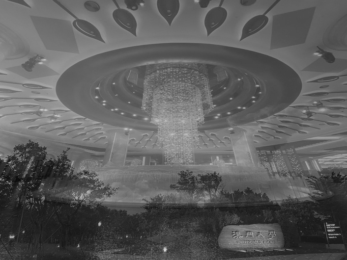
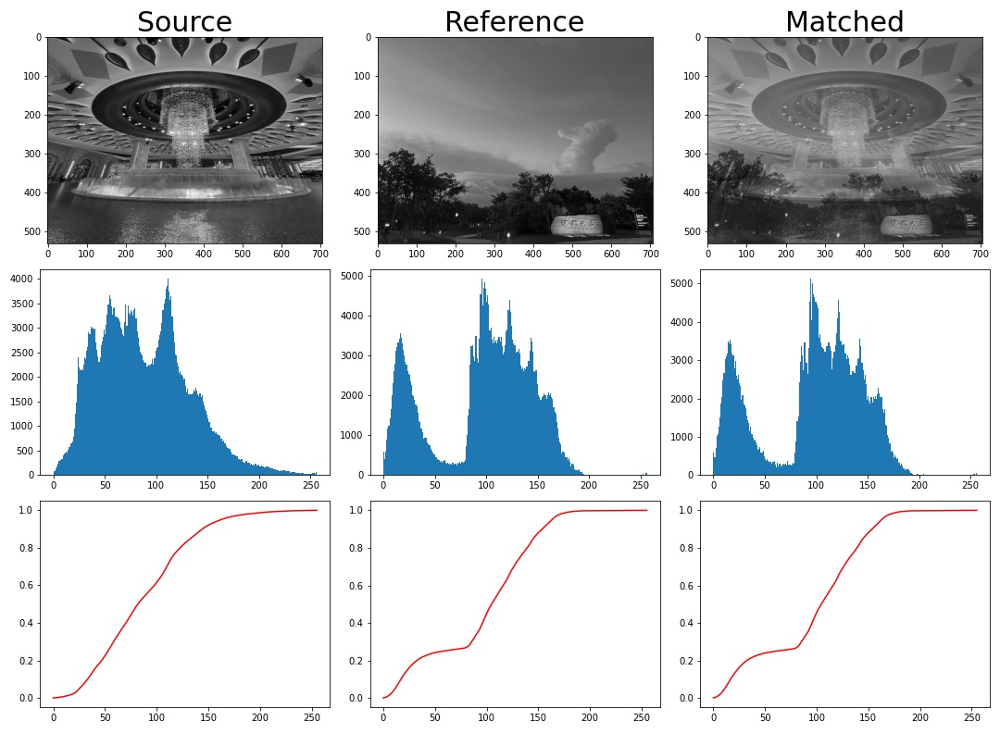
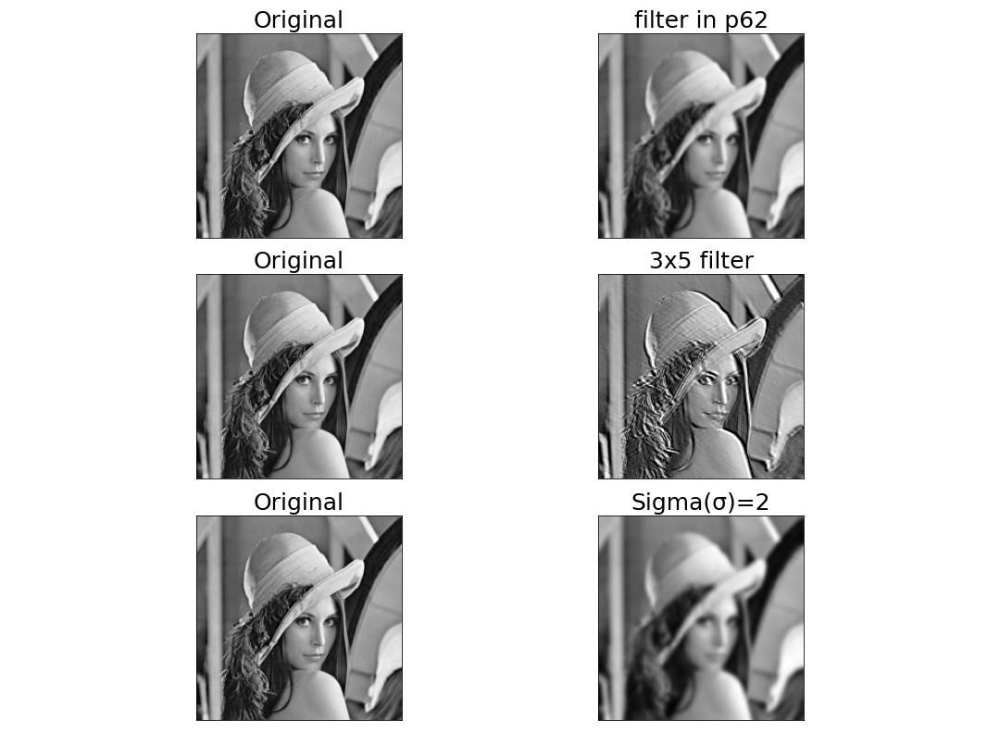

# P1
This is the output of blending reference img and source img.
The histogram is match to reference.

# P2
Apply two differents filter for bluring reference img and apply sigma gaussian filter

